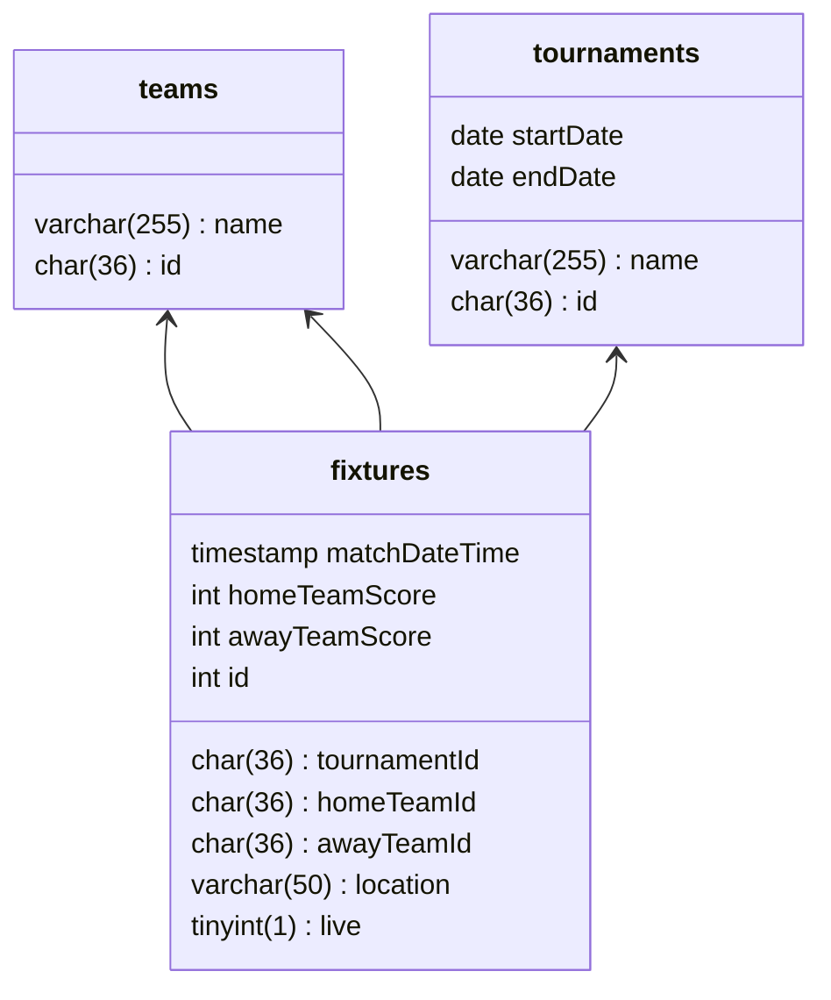

Football Fixtures API
===
This is the summary for the backend engineer test... 
# Table of Contents

[TOC]
# Prerequisites
Before you can run this project, you must have the following software installed on your computer:

## Node.js (version 16.14.2 or higher)
## MySQL (version 5.7.41 or higher)
If you already have a running mysql instance, please skip to next step.

- Install MySQL in Windows:
Download the MySQL Community Server installer from the MySQL website.
Run the installer and follow the prompts to install MySQL on your computer.
During the installation process, set a root password for the MySQL server.
Once the installation is complete, start the MySQL server and connect to it using a MySQL client such as MySQL Workbench or the command-line client.

- Install MySQL in macOS:
Install Homebrew package manager on your Mac.
Use Homebrew to install MySQL by running the command brew install mysql.
During the installation process, set a root password for the MySQL server.
Once the installation is complete, start the MySQL server and connect to it using a MySQL client such as MySQL Workbench or the command-line client.

- Install MySQL using Docker:
Install Docker on your computer.
Pull the MySQL Docker image by running the command docker pull mysql.
Run the MySQL container by running the command docker run --name mysql0 -e MYSQL_USER=admin -e MYSQL_DATABASE=football -e MYSQL_ROOT_PASSWORD=strongpassword -p 3306:3306 -d mysql.  
Once the container is running, connect to the MySQL server using a MySQL client such as MySQL Workbench or the command-line client.

# Installation
1. Clone this repository to your local machine.
2. Install the required dependencies by running `npm install --force`
3. Set environment variables
Modify the following enviroment variables accorrdingly

.env file
```bash
DB_HOST=<db host>
DB_PORT=<db port>
DB_USERNAME=<user name>
DB_PASSWORD=<password>
DB_DATABASE=<database name>
```
4. Run migration to create data tables
```bash!
npm run migration:up
```
5. Run seeding to insert some data
```bash!
npm run seed:run
```

# Usage
Run `npm run start:dev` to start the server.
```
Data Source has been initialized!
🚀  Server ready at http://localhost:8000
```
The Graphql endpoint is now available at `http://localhost:<PORT>/graphql`
# Database Design
## Database Structure and Explaination
The domain model consists of three classes: fixtures, teams, and tournaments

- **Fixture:** class represents information about a football match, with attributes such as the tournament ID, home team ID, away team ID, match date and time, scores for each team, location, and a flag indicating whether the match is currently live. Each fixture also has a unique ID.
- **Team**: class represents information about a football team, with attributes such as the team name and a unique ID.
- **Tournament**: class represents information about a football tournament, with attributes such as the tournament name, start and end dates, and a unique ID.


# API Design
Football API system is the system that requires flexibility in terms of data querying and retrieval. Instead of make multiple requests to fetch related data, leading to problems such as over-fetching, under-fetching, and network latency in RESTfull.
## API Docs
Navigate to this url to open apollographql explorer
```
http://localhost:8000
```


**Note**: make sure keep your graphql server running on localhost
## Authentication method
No authenticate required

# Testing
## Unit test
```
npm run test
```
## Integration test
not implemented yet

# Troubleshoot
If you feel that the above setup steps are complex or encounter unknown issues during configuration, that's okay. You can alternatively access the hosted server (including the database) via the following endpoints:
- Graphql API `https://app.vincentpham.online/graphql`
- [Graphql Explorer](https://app.vincentpham.online) (API document) `https://app.vincentpham.online`